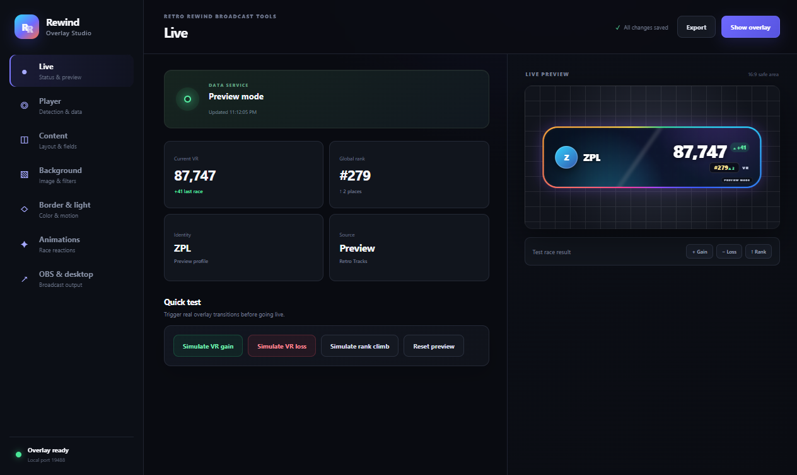
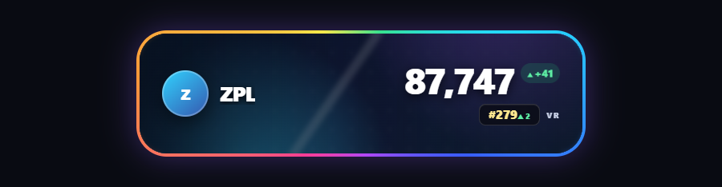

# Rewind Overlay

Broadcast-quality player stats for **Retro Rewind**. Rewind Overlay turns official Retro WFC data into a configurable OBS source and a transparent, always-on-top desktop widget.

It tracks the active player automatically through Wheel Wizard, shows current VR, the authoritative gain or loss from the last race, global rank and rank movement, and animates each change without manual stream-deck updates.

> Rewind Overlay is an independent community project. It is not affiliated with Nintendo, Retro Rewind, Retro WFC, Wheel Wizard, or OBS.



The same renderer powers the Studio preview, OBS Browser Source, and floating desktop window:



## Highlights

- **One renderer, two outputs.** Use the included OBS integration or the frameless desktop overlay; both remain pixel-identical.
- **Automatic identity.** Resolves Wheel Wizard's selected Dolphin user directory and derives the active friend code from the RetroWFC save. Console players can enter a friend code.
- **Official data.** Reads RWFC room status, player leaderboard, per-race history and Mii image endpoints. No account, token, scraping, or memory injection.
- **Accurate race deltas.** The last-race value comes from the server's race history, not a potentially ambiguous difference between polling snapshots.
- **Deep art direction.** Upload, crop, pan, zoom and filter a background; adjust tint, contrast, saturation, blur and glass treatment.
- **Advanced light engine.** Prism, chaser, pulse, wave, ghost and solid frames with independent colors, speed, width, radius and glow.
- **Event animation.** Choose count, spring, flip, impact or no motion separately for VR and rank; large gains can trigger a celebration.
- **Mii control.** Show or remove the Mii icon, use a clear backing, or choose solid and gradient backing colors.
- **Stream-safe.** Localhost-only server, no telemetry, persistent profiles, reconnect handling and a reduced-motion option.

## Install

### Windows (recommended)

1. Download `Rewind Overlay Setup <version>.exe` from the [latest GitHub release](https://github.com/MichaelAccount1/rewind-overlay/releases/latest).
2. Run Rewind Overlay. The Studio and floating overlay open together.
3. In **Player**, leave detection on **Automatic** if Wheel Wizard is installed, or choose **Friend code** for a console.
4. Turn off **Preview mode** when you are ready for live RWFC data.

A portable Windows build is published alongside the installer. macOS and Linux packages are generated by the release workflow; automatic Wheel Wizard identity depends on the launcher/save layout documented in [Data integration](docs/data-integration.md).

## Add to OBS

Rewind Overlay includes an OBS Lua integration:

1. Keep Rewind Overlay running.
2. In OBS, open **Tools → Scripts**, click **+**, and choose `rewind-overlay.lua` from the installed app's `resources/obs` folder.
3. Set the canvas size if desired and click **Add overlay to current scene**.

OBS receives an independent Browser Source directly from the app. Do not use
Window or Display Capture on the floating badge: Windows stops drawing a hidden
or minimized window. With the Browser Source, you can hide the desktop badge
and the stream overlay continues updating.

For manual setup, add a Browser Source with:

```text
URL:    http://127.0.0.1:19488/overlay?obs=1
Width:  900
Height: 260
FPS:    60
```

The page is transparent. Leave custom CSS empty. See the [OBS guide](obs/README.md) for exact installation paths and troubleshooting.

## Desktop overlay

The desktop window is transparent, self-sizing, draggable and always on top. Enable **Click through** once it is positioned so the game receives all mouse input. The tray menu remains available to turn click-through off, show or hide the overlay, and reopen Studio.

## Data flow

```text
Wheel Wizard save ──► local identity resolver ─┐
                                               ├─► player state ─► shared renderer ─► OBS Browser Source
Official RWFC API ─► room/player/race adapters ┘                               └─► desktop window
```

Rewind Overlay binds its UI/API service to `127.0.0.1:19488`; it is not exposed to the network. Player statistics are fetched directly from the official public RWFC endpoints. Details, schemas, fallback behavior and rate-limit policy are in [Data integration](docs/data-integration.md), with the underlying validation notes in [Research](docs/research.md).

## Development

Requirements: Node.js 22 or later, npm, and Git.

```powershell
npm install
npm run dev
```

Quality gates:

```powershell
npm run typecheck
npm test
npm run build
npm run package
```

The renderer is React + TypeScript. Electron owns the transparent windows, localhost service, settings persistence and RWFC adapters. See [Architecture](docs/architecture.md).

Release-by-release fixes are documented in the [changelog](CHANGELOG.md).

## Privacy and security

- No telemetry or analytics.
- No account credentials.
- Settings and uploaded artwork stay in Electron's local application-data directory.
- The service listens only on loopback.
- External player/Mii URLs are rendered as images; user HTML is never executed.
- Production dependencies are checked in CI with `npm audit --omit=dev`.

Please report vulnerabilities privately as described in [SECURITY.md](SECURITY.md).

## Legal

Released under the [MIT License](LICENSE). Mario Kart, Wii and Nintendo are trademarks of Nintendo. OBS is a trademark of the OBS Project. Other names belong to their respective owners.
